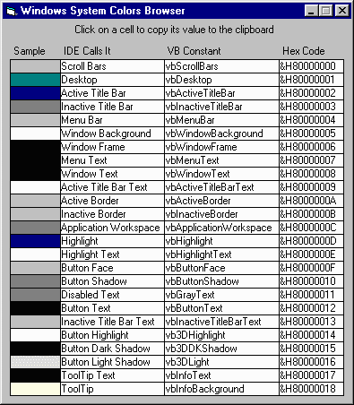



## SystemColorBrowser \- Windows System Colors

### Description

Nifty little utility (with source project) to help you use Windows system colors (e.g., "Button Face" or "Window Text") in your code. For each color, shows a preview, the name you see in IDE property window's drop-down list for colors, the VB constant, and the hex value. Tiny, easy to use, and fast.

Please vote for this entry if you like it.
 
### More Info
 

             |
---                |---
**Submitted On**   |2000-05-18 13:07:44
**By**             |[James Vincent Carnicelli](https://github.com/Planet-Source-Code/PSCIndex/blob/master/ByAuthor/james-vincent-carnicelli.md)
**Level**          |Beginner
**User Rating**    |5.0 (15 globes from 3 users)
**Compatibility**  |VB 3\.0, VB 4\.0 \(16\-bit\), VB 4\.0 \(32\-bit\), VB 5\.0, VB 6\.0
**Category**       |[Complete Applications](https://github.com/Planet-Source-Code/PSCIndex/blob/master/ByCategory/complete-applications__1-27.md)
**World**          |[Visual Basic](https://github.com/Planet-Source-Code/PSCIndex/blob/master/ByWorld/visual-basic.md)
**Archive File**   |[CODE\_UPLOAD58895182000\.zip](https://github.com/Planet-Source-Code/james-vincent-carnicelli-systemcolorbrowser-windows-system-colors__1-8180/archive/master.zip)

